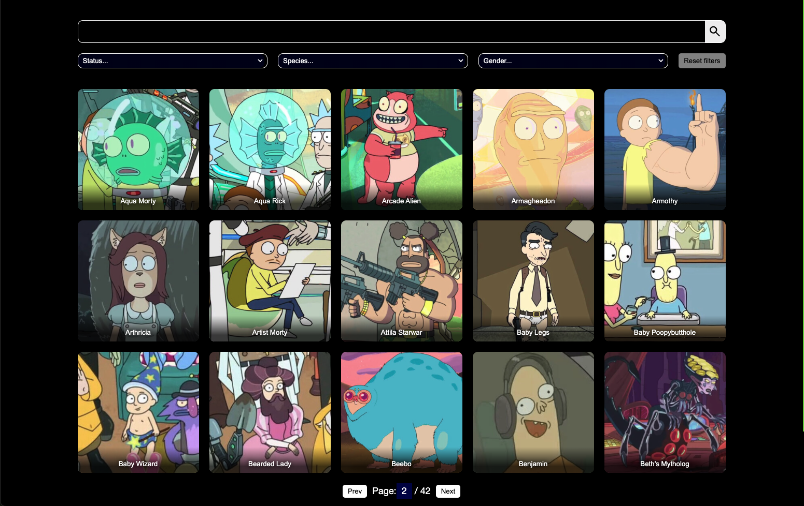
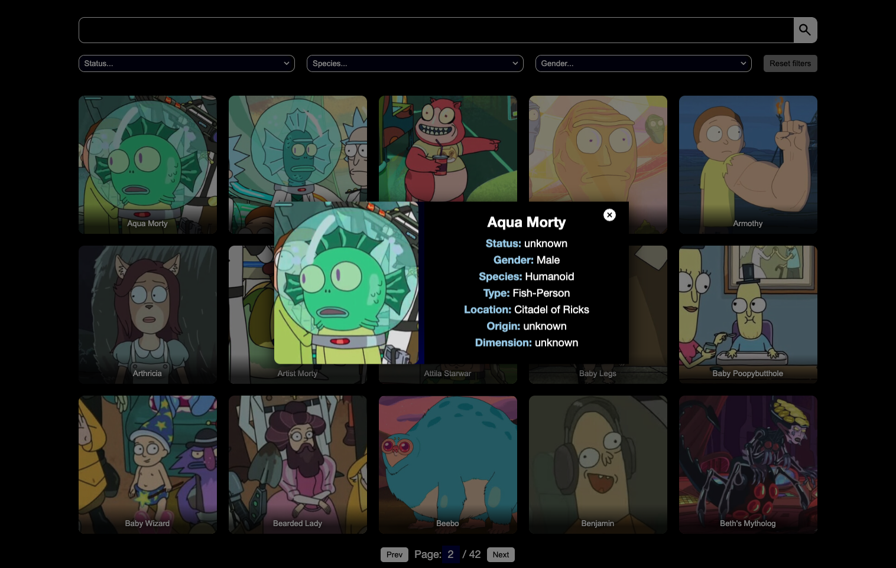
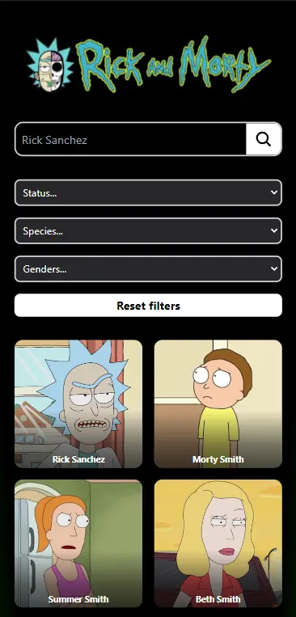
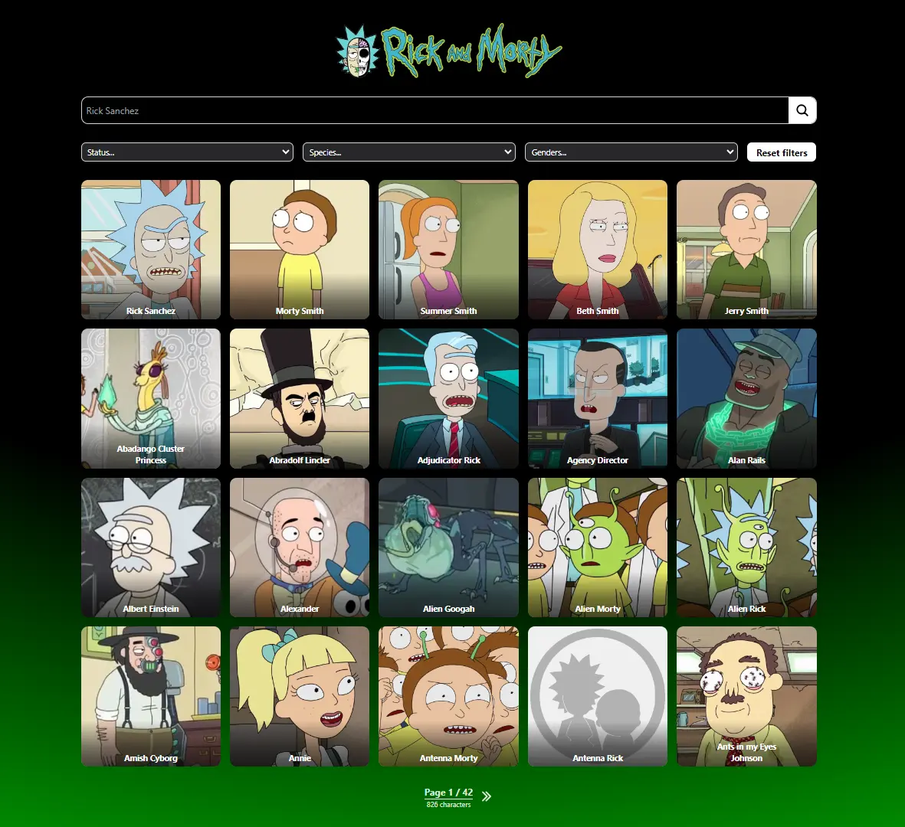

# Desafío para Dev

- Nombre postulante: Mario Gonzalez
- Link a la app en producción: [rick-and-mortyl.vercel.app](https://rick-and-mortyl.vercel.app)

## Instrucciones

- Desarrolla una aplicación web con React y Vite que permita a los usuarios buscar y visualizar información sobre personajes de la serie "Rick and Morty" utilizando la [Api de Rick and Morty](https://rickandmortyapi.com/documentation/#graphql)
- En la carpeta **challenge-dev** se encuentra una base para que partas. Puedes decidir no usarla.
- Debes crear un repositorio en github e invitar a [ieastorga](https://github.com/ieastorga) y a [gomara](https://github.com/gomara) como colaboradores.
- Avisar via mail cuando este listo.

### Requisitos Funcionales

#### Página de Búsqueda:

- Implementa una página de inicio con un campo de búsqueda.
- Los usuarios deben poder ingresar el nombre de un personaje en el campo de búsqueda.
- La aplicación debe mostrar los resultados correspondientes a la búsqueda.

#### Filtros:

- Implementa 3 filtros en la página de busqueda, (status, specie, gender).
- Los usuarios deben poder seleccionar el valor deseado en cada filtro.
- La aplicación debe mostrar los resultados correspondientes a la seleccion de los filtros. puedes inluir o no un boton para aplicar los filtros.
- Se debe incluir un boton para resetear todos los filtros incluido el buscador.

#### Visualización de Detalles:

- Al hacer clic en un personaje de la lista de resultados, la aplicación debe mostrar una página o modal de detalles con información adicional sobre el personaje seleccionado.
- Muestra al menos la imagen, nombre, especie, estado y origen del personaje.

#### GraphQL:

- Utiliza GraphQL para realizar consultas a la API de Rick and Morty en lugar de utilizar solo REST.

#### Estilo y Diseño:

- Aplica estilos para que la aplicación sea visualmente atractiva y fácil de usar.
- Puedes utilizar bibliotecas de diseño o crear tus propios estilos.

#### Paginación(BONUS):

- Implementa paginación en la lista de resultados para mostrar más personajes a medida que el usuario se desplaza.
- La API de Rick and Morty soporta paginación, puedes utilizarla para cargar más resultados.

Se espera que logres hacer una aplicación parecida a la del siguiente diagrama (es solo un ejemplo):




La funcionalidad y estructura debe ser igual, pero el diseño y variantes (por ejemplo, cambiar colores de las cosas) queda a tu gusto.

Además de esto, se espera que hagas deploy de tu app en el servicio que desees (Vercel, Heroku, Netlify, AWS, Github Pages, etc).

## Consideraciones

- Se espera que uses buenas prácticas como gitflow (pull requests y commits), orden del código, estructura, eficiencia, etc.
- Puedes dejar comentarios de decisiones que tuviste que tomar y del por qué en este repositorio.
- Se va a considerar un buen diseño de UX/UI.

## Hints

Acá van algunas cosas que pueden ser útiles (o no 👀):

- [Gitignore](https://www.toptal.com/developers/gitignore)
- [GraphQL](https://www.howtographql.com/)
- [React](https://es.reactjs.org/)
- [Styled components](https://styled-components.com/docs/basics)
- [ApolloClient](https://www.apollographql.com/docs/react/)
- [Lodash](https://lodash.com/)
- [Conventional commits](https://www.conventionalcommits.org/en/v1.0.0/)
- [Commitlint](https://commitlint.js.org/#/)
- [Eslint](https://eslint.org/)
- [Husky](https://www.npmjs.com/package/husky)
- [Vite](https://vitejs.dev/)
- [Tailwind](https://tailwindcss.com/)

---

# Solución

Este challenge es realizado con las siguientes tecnologías:

- **React + Vite**
  
  Currently, two official plugins are available:

  - [@vitejs/plugin-react](https://github.com/vitejs/vite-plugin-react/blob/main/packages/plugin-react/README.md) uses [Babel](https://babeljs.io/) for Fast Refresh
  - [@vitejs/plugin-react-swc](https://github.com/vitejs/vite-plugin-react-swc) uses [SWC](https://swc.rs/) for Fast Refresh
- **Tailwind CSS**
- **GraphQL**
- **ApolloClient**

## Imágenes mobile y desktop





## Configuración

- Se utiliza el template provisto **React + Vite**
- Se añade y configura **Tailwind CSS** como framework de utilidades CSS para estilizar la interfaz de usuario
- Se configura **Eslint** con la convención "Standard" como herramienta de linting para mantener un código consistente
- Se añade y configura **Husky** junto a **Conventional Commits** para configurar hooks de Git y ejecutar scripts automatizados, entre ellos controlar el estándar para mensajes de commit y comprobar el linting pre-commit.
- Se añade y configura **GraphQL** y **ApolloClient** para manejar consultas y manipular datos desde una API GraphQL
- Se usa y configura **context api** para evitar el prop drilling y hacer uso de un estado global para los filtros
- Se añade **just-debounce-it** para optimizar las consultas a la api y mejorar la performance
- Se añade y configura **cypress** para realizar test e2e de integración.

## Funcionalidades

- [x] Página de Búsqueda
- [x] Filtros
- [x] Visualización de Detalles
- [x] Utilizar GraphQL
- [x] Paginación

## Instalación

1. Clonar este repositorio

```bash
git clone https://github.com/lllariogonzalez/kimche-challenge
```

2. Entrar al directorio del proyecto e instalar dependencias

```bash
npm install
```

4. Crear un arhivo en la raiz del directorio `.env` para configurar variables de entorno

```bash
VITE_API_URL=https://rickandmortyapi.com/graphql
```

3. Ejecutar el proyecto en modo desarrollo

```bash
npm run dev
```

4. Abrir [http://localhost:5173/](http://localhost:5173/) en el navegador

5. Realizar test e2e de integración, en otra terminal ejecutar el script

```bash
npm run test:e2e
```

para visualizarlo

```bash
npm run cypress:open
```